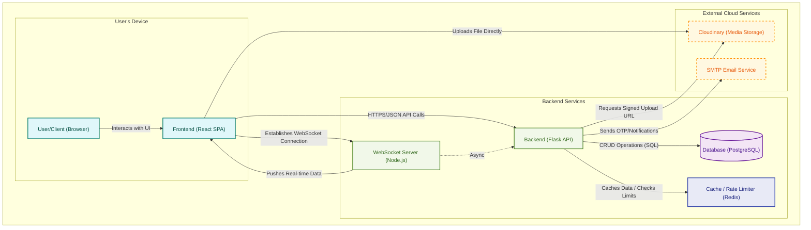

# LinkByte: A Full-Stack Social Media Platform

**Live Demo:** [https://link-byte-nine.vercel.app/](https://link-byte-nine.vercel.app/)

This is a personal project demonstrating a full-stack, distributed social media application. The architecture is intentionally decoupled to explore the interaction between different services.

---

## Core Technology Stack

*   **Backend:** Python, Flask, SQLAlchemy
*   **Frontend:** React, Vite, Tailwind CSS
*   **Real-time Service:** Node.js, Socket.IO
*   **Database:** PostgreSQL
*   **Cache / Rate Limiter:** Redis
*   **Media Storage:** Cloudinary

---

## Architectural Diagram

The system is composed of three primary services that communicate via REST APIs and WebSockets.

---

## Dummy User

*   **Username:** testuser
*   **Password:** Abcdef12

---

## Local Development Setup

Instructions to get all three services running locally.

### 1. Backend (`LinkByte-BACKEND`)

1.  `cd LinkByte-BACKEND`
2.  `python -m venv .venv`
3.  `.venv\Scripts\activate` (Windows) or `source .venv/bin/activate` (macOS/Linux)
4.  `pip install -r requirements.txt`
5.  Create a `.env` file from `.env.example` and populate the variables.
6.  `python App.py`

### 2. Frontend (`LinkByte-FRONTEND`)

1.  `cd LinkByte-FRONTEND`
2.  `npm install`
3.  Create a `.env` file from `.env.example`.
4.  `npm run dev`

### 3. WebSocket Server (`LinkByte-SOCKET`)

1.  `cd LinkByte-SOCKET`
2.  `npm install`
3.  Create a `.env` file from `.env.example`.
4.  `npm start`

---

## Project Status & Developer Notes

*   **API Definition:** The backend API is defined directly within the Flask route files. For endpoint details, refer to the source code in `LinkByte-BACKEND/routes/` and `LinkByte-BACKEND/Routes.py`. There is no separate, auto-generated documentation at this time.

*   **Testing:** A formal testing suite has not yet been implemented. This is a primary goal for future development to ensure code reliability.

---

## License

MIT License
